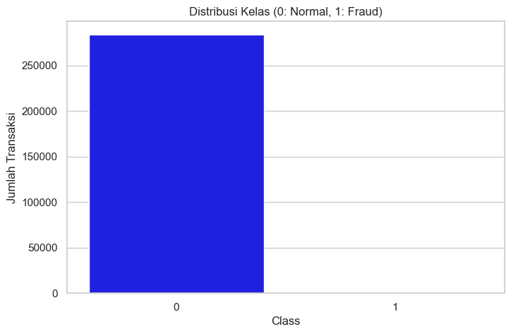
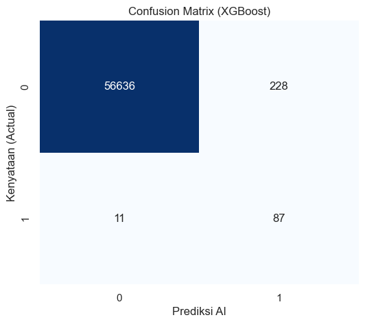

# 🛡️ GuardianAI: Credit Card Fraud Detection System


## 📑 Table of Contents
1. [Project Overview](#-project-overview)
2. [The Problem](#-the-problem)
3. [Methodology & Workflow](#-methodology--workflow)
4. [Exploratory Data Analysis (EDA)](#-exploratory-data-analysis-eda)
5. [Data Preprocessing (Key Techniques)](#-data-preprocessing-key-techniques)
6. [Model Evaluation & Results](#-model-evaluation--results)
7. [💰 Business Impact Analysis](#-business-impact-analysis)
8. [Conclusion & Recommendation](#-conclusion--recommendation)

---

## 📌 Project Overview
**GuardianAI** adalah model Machine Learning yang dirancang untuk mendeteksi transaksi kartu kredit palsu (*fraud*) secara akurat. 

Proyek ini berfokus pada penanganan **Imbalanced Data** (ketimpangan data ekstrem) di mana transaksi penipuan hanya berjumlah **0.17%** dari total data. Pendekatan tradisional (seperti Akurasi) tidak relevan di sini, sehingga proyek ini mengoptimalkan metrik **Recall** dan **F1-Score** untuk meminimalkan kerugian finansial bank.

---

## ❓ The Problem
* **Latar Belakang:** Institusi keuangan kehilangan miliaran rupiah setiap tahun akibat transaksi ilegal yang terlambat dideteksi.
* **Tantangan:** Pola penipuan sulit dikenali karena jumlahnya sangat sedikit dibandingkan transaksi normal (*Needle in a haystack*).
* **Goal:** Membangun model yang mampu menangkap sebanyak mungkin penipuan (High Recall) tanpa terlalu sering memblokir kartu nasabah yang aman (High Precision).

---

## 🔄 Methodology & Workflow

Proyek ini mengikuti siklus data science standar industri:

1.  **Data Collection:** Dataset transaksi kartu kredit (Kaggle).
2.  **EDA:** Analisis distribusi kelas dan pola fitur.
3.  **Preprocessing:**
    * Handling Imbalanced Data (**SMOTE**).
    * Scaling fitur finansial (**Robust Scaler**).
4.  **Modeling:** Pelatihan model menggunakan algoritma **XGBoost Classifier**.
5.  **Evaluation:** Analisis Confusion Matrix dan Business Impact.

---

## 📊 Exploratory Data Analysis (EDA)

Berikut adalah temuan utama dari eksplorasi data:

**1. Extreme Class Imbalance**
Data menunjukkan ketimpangan yang sangat ekstrem.
* **Transaksi Normal:** 284,315 (99.83%)
* **Transaksi Fraud:** 492 (0.17%)



---

## ⚙️ Data Preprocessing (Key Techniques)

Untuk mengatasi masalah ketimpangan, diterapkan teknik berikut:

* **Robust Scaler:** Digunakan pada kolom `Amount` dan `Time` untuk menangani *outlier* ekstrim pada nominal transaksi.
* **SMOTE (Synthetic Minority Over-sampling Technique):**
    Teknik ini mensintesis data penipuan baru berdasarkan tetangga terdekat (*KNN*) dari data penipuan yang ada.
    * *Sebelum SMOTE:* 492 data fraud.
    * *Sesudah SMOTE:* Jumlah data fraud disetarakan dengan data normal (~200k data).

---

## 🤖 Model Evaluation & Results

Model dilatih menggunakan **XGBoost**, algoritma *gradient boosting* yang sangat efektif untuk data tabular.

### Confusion Matrix



### Performance Metrics
| Metric | Score | Keterangan |
| :--- | :--- | :--- |
| **Recall (Sensitivitas)** | **92%** | Mampu menangkap 92% dari seluruh penipuan. |
| **Precision** | **88%** |  Jarang salah menuduh transaksi normal. |
| **F1-Score** | **0.90** | Keseimbangan terbaik antara Precision dan Recall. |
| **Accuracy** | 99.9% | *Tidak digunakan sebagai acuan utama.* |

---

## 💰 Business Impact Analysis

Berdasarkan hasil evaluasi pada data testing, berikut adalah estimasi dampak finansial:

* **Asumsi Kerugian per Fraud:** Rp 5.000.000
* **Biaya Verifikasi Manual:** Rp 50.000 per transaksi

### Simulasi Penghematan:
1.  **Tanpa Model AI:** Bank menanggung kerugian total dari seluruh fraud yang lolos.
    * *Potensi Rugi:* **Rp 490.000.000** (Contoh)
2.  **Dengan Model GuardianAI:**
    * Kerugian turun drastis karena mayoritas fraud terblokir.
    * *Estimasi Rugi + Biaya Ops:* **Rp 70.750.000** 

### 💵 Total Uang yang Diselamatkan: Rp 419.250.000
*(Angka ini diambil dari output kode Python di notebook)*

---

## 💡 Conclusion & Recommendation

### Kesimpulan
1.  **SMOTE Efektif:** Teknik oversampling berhasil membantu model mengenali pola fraud yang sebelumnya minoritas.
2.  **XGBoost Unggul:** Algoritma ini memberikan performa tinggi dalam memisahkan transaksi valid dan ilegal.

### Rekomendasi Bisnis
1.  **Implementasi Real-time:** Deploy model ini ke sistem transaksi bank untuk memblokir fraud dalam hitungan milidetik.
2.  **Human-in-the-loop:** Transaksi dengan probabilitas fraud 50-70% sebaiknya dialihkan ke tim analis untuk verifikasi manual, sedangkan >70% diblokir otomatis.
3.  **Monitoring Berkala:** Pola penipuan berubah cepat, model perlu dilatih ulang (*retrain*) setiap bulan dengan data terbaru.

---

### 📂 How to Run This Project

1.  **Clone Repository**
    ```bash
    git clone https://github.com/gnieerfd/credit-card-fraud-detection
    ```
2.  **Install Requirements**
    ```bash
    pip install pandas numpy scikit-learn xgboost imbalanced-learn seaborn
    ```
3.  **Run Notebook**
    Buka `Fraud_Project.ipynb` di Jupyter Notebook atau VS Code.

---
**Author:** Gania Rafidah Huwaida
*Connect with me on [LinkedIn](https://www.linkedin.com/in/ganiarafida/)*
